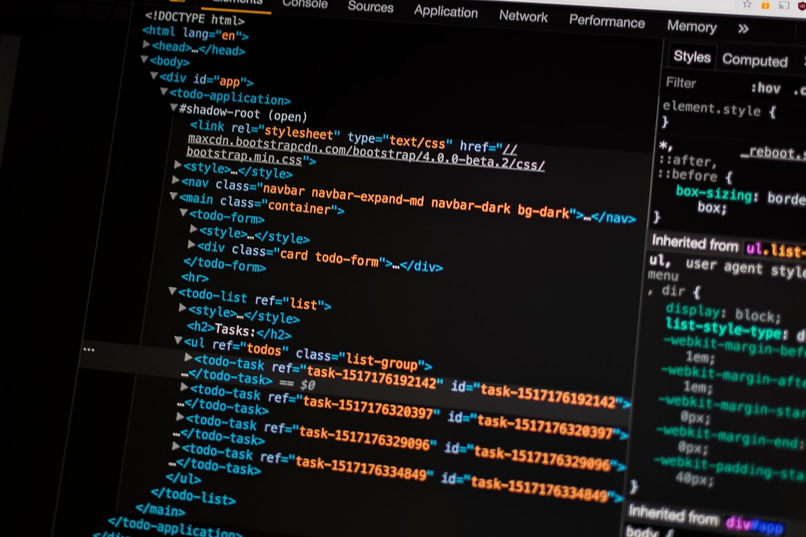

## Introduction  

Approaching the vastly difficult and applicable field of software engineering for the first time is a challenge for anyone, even for someone like myself who has had plentiful experience with software development and project management in the past. There are a ton of concepts and techniques that I had zero experience with prior to the past few months. Since I have finished a major project as a part of my journey—being the final project for my Software Engineering course—I think it is necessary to reflect on some of the major concepts I learned on the subject and explore how I benefited from them.  

## Functional Programming  

The first and arguably most widely applicable concept I equipped was that of functional programming. Functional programming, often contrasted with object-oriented programming, is a programming methodology that emphasizes the use of functions as the main structural focus of the program’s functionality.  

Those familiar with programming but not necessarily functional programming may be confused by this notion. Aren’t functions used in most code anyways? Well, sure, that is true, but let me elaborate a bit on what I mean specifically. Functions in functional programming, as opposed to other paradigms like object-oriented programming, are the main building blocks of a program.  

What this means is that the data or objects modified within this program are unchanging, and functions are solely used to modify and utilize them. Rather than taking time changing an object to be passed through functions, more functions will instead be built to modify the existing objects. Another implication of functional programming is that functions can be passed through other functions, making for flexible, reusable code.  

To demonstrate this concept by example, below is a Python code snippet that passes a function and a value through another function. This is, in my opinion, much easier to grasp than programs that often assign new values just to pass a value through multiple functions.  

```python
def apply_function(func, value): 
    return func(value)

def square(x): 
    return x * x

print(apply_function(square, 5))
```
Understanding functional programming is extremely important for my own future as a software engineer, as it is a concept commonly applied in a variety of languages such as JavaScript, Scala, Python, and Java.

## User Interface Frameworks
The second concept (or rather tool) that I would like to discuss is that of User Interface (UI) frameworks such as React Bootstrap. These frameworks, to put it simply, are libraries and tools that help developers easily build consistent and attractive user interfaces effectively.

They provide components and styles that are pre-designed to be flexible and responsive, speeding up and smoothing out a lot of the front-end effort that software developers like myself oftentimes dread to do. Designing an interface for a user who doesn’t understand the effort that it takes to build a web application is frustrating, to say the least, and personally, I have found that UI frameworks are a huge help in this process.

One example of a UI framework that I have heavily explored is React Bootstrap, which, as previously mentioned, includes pre-made components like buttons, nav bars, forms, cards, and icons that are easy to access and modify to one’s liking. To illustrate the difference in effort between using and not using a UI framework, I have provided below an example of two snippets of code.

## With React Bootstrap
```jsx
import { Button } from 'react-bootstrap';

function App() {
    return <Button variant="primary">Click Me</Button>;
}
```
## Without React Bootstrap
```jsx
function App() {
    return (
        <button
            style={{
                backgroundColor: '#007bff',
                color: '#fff',
                padding: '10px 20px',
                border: 'none',
                borderRadius: '4px',
                cursor: 'pointer',
            }}
            onClick={() => alert('Button clicked!')}
        >
            Click Me
        </button>
    );
}
```
The first snippet utilizes React Bootstrap, which simply requires that a developer imports a component and uses it. When trying to create an equivalently stylish component manually, the process requires plain HTML and CSS to be written, which not only adds more code but also requires a lot of effort to check your work while making the style.

This difference in effort allows me as a software developer to focus on arguably more important parts of a program, like functionality. In the future, I wholly intend to utilize UI frameworks to expedite the coding process significantly.

Software engineering concepts and tools like functional programming and UI frameworks are vital to my capability as a programmer and project participant. I intend to continue to learn more about them and apply them in the future so that I can become the strongest software developer I can be.
