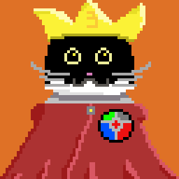
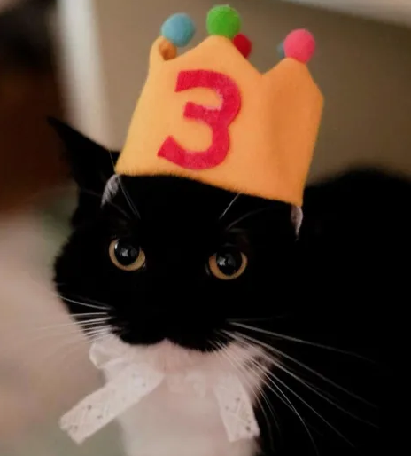
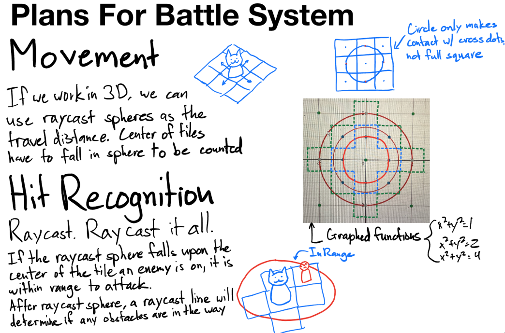

  
  

Credit for the pixel art goes to Christian Iha, and credit for the plan drawings goes to Jack Saito.
 
The Untitled Cat RPG is the project that my team and I are currently working on. Our humble team is of three, including myself and my best friends Jack Saito and Christian Iha. The project initially started as a potential idea for the July 2023 "Random Jam", a game jam in which randomness would be a key factor. As the project was far too ambitious, we discarded the idea of doing it as a game jam and instead decided to work on it separately. The game draws inspiration from a variety of our favorite turn based role playing games, but features some of our favorite creatures from the real world: cats! The roster of characters includes internet famous cats as well as our friends' own pets, with even more creatures to be made in the future. 

The game's vision is quite ambitious, especially for three people. To describe it as concisely as possible: it is an isometric tactical RPG, inspired heavily by Paper Mario’s overworld mechanics/story, D&D’s turn system, and Pokemon Conquest’s combat. I, as the lead game designer, am entirely responsible for every aspect of game design in ths project such as mechanic design, storyboarding, and balancing. On top of all of the game design aspects, I am in charge of all related game documentation, which serves as a checkpoint for us to see how far we've come as developers. As of September 4th, 2024, the project has a great deal of groundwork in both planning and creation, including programming and artwork, and it's documentation can all be found [here.](https://docs.google.com/document/d/1h5qOJshfEPVNhIgCYeg17AhTwQLs4B6J8enNqWTF_aQ/edit?usp=sharing)
