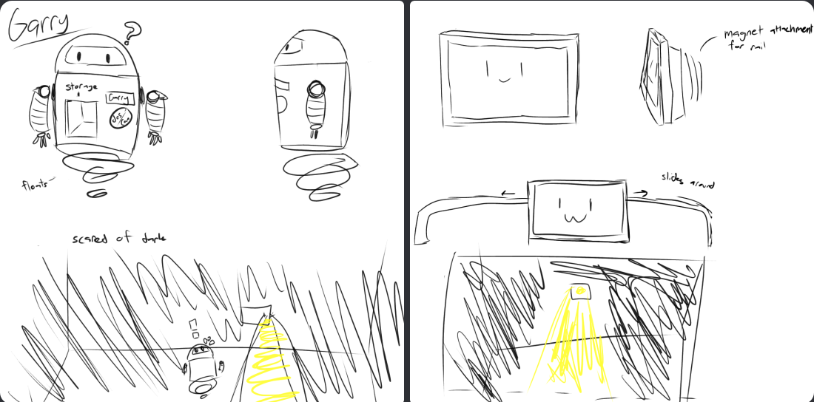
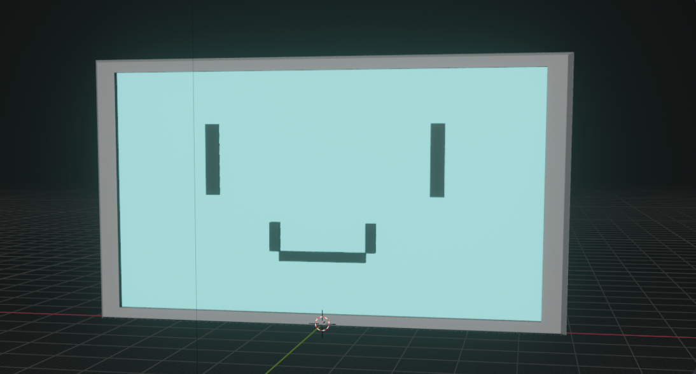

  
  

Larry and Garry was a project created for the 2023 "0-Gravity" game jam hosted by Spoilz Games. The jam took place over the course of three days, and the theme was "Outer Space". The game was designed to be a puzzle game featuring two cute robot characters: Larry and Garry. To match the theme, we intended the game to take place in a robot testing facility on the moon. Additionally, the main mechanic featured for the puzzles took the phrase "Outer Space" literally, using both the "inner space" and "outer space" of the facility to solve puzzles. In the game you control both Larry and Garry, who each have distinct roles. Garry is trapped in the testing facility, surrounded by complete darkness. Larry, from outside the box, must shine light into the room from the outside using his handy robo-flashlight. The gameplay loop involves moving Larry to holes in the wall to provide light, and then using Garry to solve puzzles using clues within the room, which unlock more holes in the wall.

As this was the first game that my team and I had worked on, we had little prior experience with game development. As such, though the project had great progress, it went ultimately unfinished. That being said it was a valuable and enjoyable experience for my friends and I, especially in admittedly difficult aspects such as planning and coding even the most basic mechanics. Each person in my team had equivalent contribution in the coding aspects of the game, but we each were in charge of a specific aspect, mine of which is game and puzzle design. As such the greatest of my contributions involved mapping out the game's sequencing. This involved drawing hint art and "storyboarding" the puzzles. The code in this project was using C#, a language in which I had little experience at the time. I had created all of the code for interacting with different aspects of the puzzles, such as buttons, pressure plates, and item holding. Overall the project was a success, for it provided valuable experience in game development to use in future projects. 

[Linked here](https://docs.google.com/presentation/d/1n4gp4tsUMfS1Dj_eH3ju50F4ob3fy0r97b0FFBo43tI/edit?usp=sharing) is a google slides presentation which is where all of the planning was done. At the end of the slide dock is a video created towards the end of the project which showcases some of what it looked like. 

